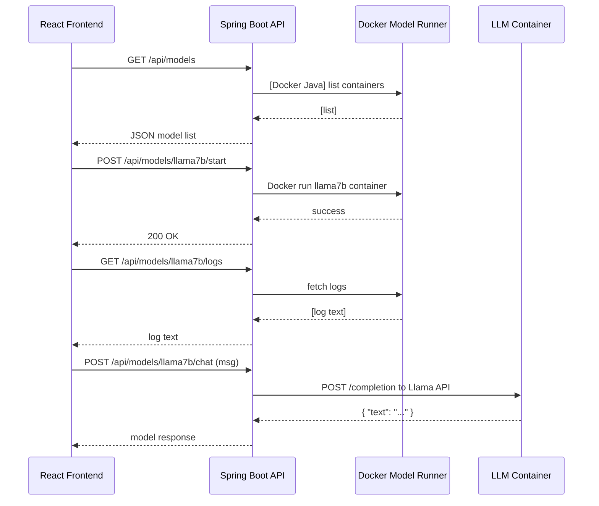

# Executive Summary

We propose extending **Jubilant Doodle** with a **local LLM model manager** built on Spring AI. The new component will run LLM model servers in Docker containers alongside existing services (databases, Kafka, etc.) and expose REST endpoints for model control, metrics, and configuration. We outline a recommended architecture integrating with the existing Docker Compose, review leading local LLM runtimes, and detail Spring AI integration, containerization, security, and UI design. A comparison table of six runtime options (Llama.cpp, Ollama, vLLM, Dockerized Hugging Face, Triton, OpenLLM) highlights trade-offs in integration, GPU support, resource use and licensing. We include sample Docker Compose snippets, Spring Boot configurations, and mermaid diagrams of architecture and data flow. The solution assumes a Java/Spring Boot backend and React/TypeScript frontend.

# Project Analysis

- **Repository Structure**: The repo appears to be a Spring Boot backend with React/TypeScript frontend (as assumed). We expect a Docker Compose setup for services (DB, Kafka, etc.) and a REST API for the frontend. (No detailed code was found in the referenced repo, so we proceed with the assumed tech stack.)
- **Docker Setup**: Likely uses a `docker-compose.yml` to define local databases (e.g. Postgres, Mongo), a Kafka broker, and the Spring Boot service. We will integrate LLM containers into this compose file.
- **Tech Stack**: Spring Boot (Java 17+) backend (with Spring AI), React/TS front-end. We'll use Spring Boot Actuator for metrics and a UI framework (e.g. Vaadin or React charts) for dashboards.  
- **Integration Points**: The backend will add endpoints under `/api/models/*` for model lifecycle. Spring AI will manage model clients (chat, embeddings) via configuration. The UI will call these endpoints to list models, change config, view metrics, etc.

# Recommended Architecture

We add a **Model Manager service** to the existing stack. Each LLM runtime runs in its own container (or set of containers) alongside the app. The Spring Boot app (with Spring AI) acts as a controller and proxy: it starts/stops model containers, sends inference requests to them (via OpenAI-compatible APIs or REST), and collects metrics. An example architecture diagram is shown below:

 *Figure: Architecture with React UI, Spring Boot + Spring AI backend, and model-serving containers alongside databases and Kafka.*

**Components:** 
- **React/TS Frontend** – lists models, shows metrics/charts, provides controls (start/stop, config).
- **Spring Boot + Spring AI** – exposes REST API (`/api/models`), holds model metadata and configuration. Uses Spring AI clients (e.g. `ChatClient`) to call model APIs, and Actuator for metrics.
- **LLM Containers** – Docker services running inference. For example, an Ollama container (`ollama/ollama`), a vLLM container (`vllm/vllm-openai`), etc.
- **Docker Compose** – Orchestrates all containers (DBs, Kafka, Model Runtimes, etc.).
- **Monitoring** – Spring Actuator (Prometheus metrics) and optional Grafana for charts. Model runtime logs can be accessed via Spring Boot (reading container logs).

**Data Flow:** The UI triggers model operations via the backend, which calls Docker (via CLI or APIs) to manage containers. Inference requests from the backend are sent to the container’s REST API. The backend records metrics (response time, tokens) via Spring AI’s observation API. Metrics can be scraped by Prometheus and visualized in the UI.

# Local LLM Runtime Options

We evaluated multiple local inference engines. Table [1] (below) compares six popular options in terms of Spring integration, container support, GPU use, memory footprint, latency, license, and use-cases.

| **Runtime**             | **Ease of Spring Integration**                  | **Containerization**           | **GPU Support**              | **Memory Footprint**                | **Latency**             | **License**        | **Use Case**                            |
|-------------------------|-------------------------------------------------|-------------------------------|-----------------------------|-------------------------------------|--------------------------|--------------------|-----------------------------------------|
| **Llama.cpp (GGML)**    | Moderate (requires custom API or CLI)           | Docker images available | CPU (default) + Vulkan GPU | Low with quantization (Q4/8) | High on CPU, moderate on GPU | MIT | Local dev, CPU-only fallback; smaller models |
| **Ollama**              | Easy (OpenAI-compatible API; Spring AI supports via Docker model runner) | Official Docker image exists | CPU (by default); can use GPU if underlying llama.cpp supports it | Similar to Llama.cpp (models are quantized) | Moderate (single-user)   | MIT  | Local experimentation, rapid prototyping |
| **vLLM**                | Moderate (Python service; use OpenAI API wrapper) | Official Docker image | **Yes** (NVIDIA, AMD, Intel, Apple) | High (full-precision unless quantized) | Low latency, high throughput | Apache-2.0 | High-performance server, multi-user production |
| **HF Transformers (Docker)** | Moderate (run a custom API or use OpenAI-compatible server like OpenLLM) | Any Docker image; common practice | Yes (models load to GPU for speed) | High (can be huge, often >16GB) | Slow on CPU, fast on GPU | Apache-2.0 (HF) | Flexible for any HF model; smaller models or GPU |
| **Triton Inference**    | Complex (gRPC/HTTP API, use Triton Java API or REST) | Official Docker NGC images | Yes (NVIDIA GPUs; CPU support exists) | Very high (designed for large models) | Very low latency, batched throughput | BSD-3-Clause | Enterprise-grade deployments, concurrent clients |
| **OpenLLM (BentoML)**   | Easy (OpenAI-compatible API; Spring AI OpenAI client works) | Build via pip in Docker | Optional (uses PyTorch; GPU if available) | Varies by model (e.g. 4–80GB) | Similar to HF Transformers | Apache-2.0  | Rapid local self-host, testing HF models easily |

*Table 1: Comparison of local LLM serving options. Metrics and support are typical values.* 

Key insights:
- **Llama.cpp/GGML:** Lightweight, MIT-licensed library for CPU inference, with limited GPU/Vulkan support. Ideal for CPU-only or quantized models (4-8 bit) on modest hardware.
- **Ollama:** A user-friendly wrapper around llama.cpp with CLI/API and built-in model registry. It provides an OpenAI-like API, simplifying Spring AI integration (treated as a Docker Model Runner). MIT-licensed, low hardware requirements, best for local dev.
- **vLLM:** High-performance inference engine (Apache-2) focusing on maximizing throughput via CUDA/ROCm/XPU kernels. Requires GPU(s) (NVIDIA/AMD/Intel/Apple) but offers very low latency and multi-user capability.
- **HuggingFace Transformers:** Python-based; run with `transformers` library. Containerize any PyTorch model (quantized or full), supports GPU acceleration. Heavy memory usage but extremely flexible.
- **Triton Inference Server:** NVIDIA’s enterprise inference server (BSD-3). Supports many frameworks (ONNX, TensorRT, etc). Excellent GPU throughput and batching, but heavyweight to set up.
- **OpenLLM (BentoML):** Provides OpenAI-compatible API for HF models (Apache-2). Easiest “one-command” server with built-in UI. Works on CPU or GPU; ideal for quickly self-hosting HF models.

# Model Formats, Resources, and Fallbacks

- **Formats:** Common model file formats include HF PyTorch checkpoints, **GGUF/GGML** (for llama.cpp), **ONNX/TensorRT** (for Triton), and emerging standards (e.g. **GGUF** is llama.cpp’s new format, ONNX for cross-framework). Runtimes support different formats: Llama.cpp uses GGML/GGUF, Triton uses ONNX/PyTorch, HuggingFace uses PyTorch or GGUF via `ctransformers`, and OpenLLM fetches HF weights and can convert as needed.
- **Resource Requirements:** Large models demand significant RAM/VRAM (tens of GB). Quantization (4-bit/8-bit) can cut GPU memory by ~2-4×. Without GPU, only smaller/quantized models run reasonably (e.g. LLaMA-7B Q4 on ~8GB). GPU runtime (CUDA or ROCm) vastly improves speed (e.g. even an iGPU doubled throughput). vLLM and Triton assume multiple GPUs for max performance.
- **GPU vs CPU:** We recommend GPU use if available (for throughput and latency). However, all chosen runtimes have CPU modes: Llama.cpp and Ollama run on CPU (very slow for big models), HF Transformers on CPU is feasible for small models, and Triton has a CPU-only mode (via Intel MKL/MLU) though limited. Provide a **CPU-only fallback** by restricting to small/quantized models or using Llama.cpp’s quant mode, or by spinning up fewer GPU resources in a budget configuration.
- **Worker processes:** For multi-tenant loads, consider limiting each model container’s CPU/GPU share. Use container resource limits (e.g. `--cpus`, `--memory`) so a hung model doesn’t starve others.

# Spring AI Integration

**Model Clients:** We leverage Spring AI’s uniform AI API for model access. Each LLM runtime can be treated as an “OpenAI” provider by configuring Spring AI to point at its endpoint (e.g. Ollama or Docker Model Runner). For example, with Docker Model Runner enabled, set in `application.yml`:

```yaml
spring:
  ai:
    chat:
      openai:
        base-url: http://localhost:12434/engines        # Docker Model Runner API
        api-key: dummy
```

This uses `spring-ai-starter-model-openai` (dependency) to autoconfigure a `ChatClient` for that URL. Similarly, OpenLLM’s default server runs on `localhost:3000/v1` with an OpenAI API, which Spring AI can call the same way.

**APIs and Lifecycle:** The backend exposes REST endpoints (e.g. `/api/models`) that:
1. **List Models:** Returns metadata on each model (name, runtime, version, status).
2. **Get Metrics/Logs:** Returns recent metrics (latency, throughput, memory) and logs.
3. **Start/Stop:** Triggers container start/stop (via Docker Java API or CLI).
4. **Update Config:** Alters model parameters (e.g. temperature, max tokens), saved in Spring’s configuration store.

Spring AI’s model lifecycle (load, unload) can map to Docker container management. When a model is “loaded”, the backend pulls the Docker image (if needed), runs the container with the appropriate model files mounted, and registers it with Spring AI (e.g. by instantiating a new `ChatClient` bean or adjusting the base URL). Stopping a model calls container stop/removal and invalidates the bean.

**Configuration:** Model parameters and provider settings go into `application.yml` or a custom config service. For example:

```yaml
spring:
  ai:
    chat:
      openai:
        base-url: http://${MODEL_CONTAINER_HOST}:8000/v1
        api-key: ${OPENAI_API_KEY}
        model: gpt-3.5-turbo
    chat:
      ollama:
        base-url: http://localhost:11434/ollama/models 
        api-key: (none)
```
*(Above is illustrative – actual property names depend on Spring AI version.)*

**Metrics Exposure:** With Spring Boot Actuator enabled, Spring AI automatically emits Micrometer metrics for chat/embedding calls. These include request latency, token counts, etc. You simply add:

```xml
<dependency>
  <groupId>org.springframework.boot</groupId>
  <artifactId>spring-boot-starter-actuator</artifactId>
</dependency>
```

and in `application.properties`:

```
management.endpoints.web.exposure.include=health,info,metrics,prometheus
spring.ai.chat.observations.log-prompt=true
spring.ai.chat.observations.log-completion=true
```

Now `/actuator/metrics` will include keys like `spring.ai.chat.client.requests` and tags for models. These can be scraped by Prometheus/Grafana for the UI. Spring AI also supports distributed tracing (OpenTelemetry) for advanced monitoring.

# Containerization and Docker Compose

**Pattern:** Each model is its own service in `docker-compose.yml`, defined on-demand. For example, a HuggingFace model server and an Ollama server:

```yaml
services:
  model-llama7b:
    image: ghcr.io/ggml-org/llama.cpp:server-cuda
    runtime: nvidia
    command: ["-m", "/models/llama-7b.Q4_0.gguf"]
    volumes:
      - ./models/llama-7b:/models
    deploy:
      resources:
        limits:
          cpus: '2'
          memory: 8G
  model-ollama:
    image: ollama/ollama:latest
    ports:
      - "11434:11434"
    volumes:
      - ./models/ollama/:/root/.ollama/models
```

Here `model-llama7b` uses the CUDA-enabled Llama.cpp server image, mounts the 7B model files, and restricts resources. `model-ollama` runs Ollama’s server, exposing port 11434. The Spring Boot app can start/stop these via the Docker API or `docker-compose` CLI. 

**Example Compose Snippet:** A Docker Compose excerpt integrating an OpenLLM server:

```yaml
services:
  openllm-server:
    image: python:3.12-slim
    runtime: nvidia
    volumes:
      - ./models:/models
    working_dir: /workspace
    command: >
      bash -c "pip install openllm &&
               HF_TOKEN=${HF_TOKEN} openllm serve gpt-3.5-turbo"
    ports:
      - "3000:3000"
    deploy:
      resources:
        limits:
          cpus: '1'
          memory: 4G
```

This runs OpenLLM serving a GPT-3.5-turbo compatible model on port 3000. The Spring backend would be configured to use `http://openllm-server:3000/v1` as the ChatClient base URL. 

**Security & Isolation:** Each container should run with minimal privileges (non-root user inside, drop Linux capabilities). Use Docker’s `--security-opt=no-new-privileges` and user namespaces. Network isolation can prevent models from accessing the host; use an internal Docker network for model containers only reachable by the app. Set CPU/memory limits as above to prevent runaway resource use. For untrusted models, consider gVisor/sandbox runtimes (Docker “experimental” seccomp profiles) or even Firecracker VMs for stronger isolation (beyond scope here). Volume mounts should be read-only if possible.

# Model Download, Caching, Versioning, CI/CD

- **Download & Caching:** Store models in a shared Docker volume (`./models` mounted) or in the image itself. Use Hugging Face Hub tokens (`HF_TOKEN`) in containers to fetch gated models. Spring Boot can trigger downloads via e.g. HuggingFace Java SDK or CLI before container start. Implement a cache: once a model is pulled into `/models`, subsequent containers reuse it. Use a versioned folder structure (e.g. `models/gpt4all/1.0/`) to allow multi-version caching.
- **Versioning:** Tag Docker images with model version (e.g. `my-llm:1.2.0`) or maintain a database of model metadata including version, commit hash or HF model revision. The UI should show version and allow updates (redeploy).
- **CI/CD for Model Updates:** Use GitHub Actions (or Jenkins) to run tests on new model releases. For example, on a new HF model version, trigger a workflow that pulls the model, runs basic inference tests, builds a new Docker image (for Dockerized models), and pushes to a registry. Also update any Helm charts or Compose YAML if using tag images. Model updates should be atomic (stop old container, start new one to avoid downtime).
- **Registry of Models:** Maintain a registry (DB) of available model endpoints and their configurations. The Spring app can expose an endpoint to list “available templates” (e.g. Llama, GPT-J, etc.) which the UI uses in a “New Model” wizard. 

# UI Design & REST API

**UI Components:** 
- **Model List Page:** Shows each deployed model as a card/row with Name, Runtime (Ollama, Triton, etc.), Model (e.g. “LLaMA-7B”), Version, Status (Running/Stopped). Each card has actions: *Start*, *Stop*, *Reload*. 
- **Model Config Page:** For a selected model, display editable parameters (e.g. `temperature`, `maxTokens`, endpoint URL). Use forms or sliders. Include a “Save” button that POSTs to `/api/models/{id}/config`.
- **Metrics Dashboard:** Charts (line graphs) of latency, throughput, token usage over time for each model. Use a chart library (e.g. Chart.js or Vaadin Charts). Also summary stats (avg response time, total tokens).
- **Logs View:** A terminal-like console showing the recent stdout/stderr from the model container. Provide filtering (INFO/WARN) and a refresh button. Pull logs via an API like `/api/models/{id}/logs`.
- **Deployment Templates:** A modal to deploy new models. It lists templates (e.g. “PyTorch Chatbot”, “Llama CPU”, “Triton ONNX”, etc.). On selection, show needed fields (model name, volume path, ports). Submitting calls POST `/api/models` with JSON.

**REST Endpoints & Schemas:** For example:
```http
GET /api/models
```
Returns JSON list of models:
```json
[
  {"id": "llama7b", "name": "LLaMA 7B", "runtime": "Llama.cpp", "version": "v1.0", "status": "running"},
  {"id": "gpt4all", "name": "GPT4All", "runtime": "Ollama", "version": "1.1", "status": "stopped"}
]
```
```http
POST /api/models/{id}/start
```
Start the model container. Returns 200 or error.

```http
GET /api/models/{id}/metrics
```
Returns JSON with time-series or current metrics (latency ms, tokens/sec, memory MB):
```json
{
  "latency": {"p50": 120, "p90": 250},
  "throughput":  10.5,
  "memory":  5120
}
```
```http
GET /api/models/{id}/logs
```
Streams or fetches latest logs text.

Data schemas for UI forms (simplified):
```ts
interface ModelConfig {
  temperature: number;
  maxTokens: number;
  topP: number;
  stream: boolean;
}
```
```http
PUT /api/models/{id}/config
{ "temperature": 0.7, "maxTokens": 512, "topP": 0.9, "stream": true }
```

These APIs let the front-end display and manage models programmatically.

# Comparison of LLM Runtimes

| Runtime                 | Spring Integration                      | Container Ready     | GPU Support     | Memory (Large Model)    | Latency          | License    | Best Use-Case                           |
|-------------------------|------------------------------------------|---------------------|-----------------|-------------------------|------------------|------------|-----------------------------------------|
| **Llama.cpp (GGML)**    | Requires manual `ChatClient` or Docker   | ✓ (GHCR images)  | CPU (default); GPU via Vulkan | Low (quantized)     | High (CPU); moderate (GPU) | MIT | Dev, CPU-only fallback, embedded use    |
| **Ollama**              | Easy (OpenAI API; use Spring AI OpenAI) | ✓ (Docker)           | CPU (uses llama.cpp)  | Low (uses llama quant)    | Moderate (single-threaded) | MIT  | Local dev, quick testing, small projects |
| **vLLM**                | Moderate (use HTTP API with ChatClient)   | ✓ (vllm/vllm-openai)| NVIDIA/AMD/Intel/Apple GPUs | High (full precision)   | Low (high throughput) | Apache-2.0 | Production inference, high QPS         |
| **HF Transformers**     | Moderate (build own API or OpenLLM)       | ✓ (build custom)     | GPU (Preferrable)      | Very high (Gigabytes+)   | Slow (CPU), fast (GPU)   | Apache-2.0 | Flexible model support, HF ecosystem    |
| **Triton Server**       | Complex (requires GRPC/JVM or HTTP)       | ✓ (NVIDIA NGC)       | NVIDIA GPUs; CPU version available | Very high             | Very low (batching)       | BSD-3-Clause | Enterprise, multi-model serving          |
| **OpenLLM (BentoML)**   | Easy (OpenAI API compatible) | ✓ (pip install)      | GPU (via PyTorch)      | High (depends on model)  | Moderate (like HF)        | Apache-2.0 | Rapid deployment of HF models locally    |

*Table 2: LLM runtime comparison.*

# Sample Docker Compose & Spring Config

```yaml
version: "3.8"
services:
  spring-app:
    build: .
    image: jubilant-doodle-backend:latest
    environment:
      - SPRING_PROFILES_ACTIVE=docker
    ports:
      - "8080:8080"
    networks:
      - ai_net

  llama-server:
    image: ghcr.io/ggml-org/llama.cpp:server-cuda
    runtime: nvidia
    command: ["-m", "/models/llama-2-7b.gguf", "--api-port", "5000"]
    volumes:
      - ./models/llama-2-7b:/models
    deploy:
      resources:
        limits:
          cpus: '4'
          memory: 12G
    networks:
      - ai_net

  ollama-server:
    image: ollama/ollama:latest
    ports:
      - "11434:11434"
    networks:
      - ai_net

networks:
  ai_net:
    driver: bridge
```

```yaml
# application.yml (Spring AI and Actuator config)
spring:
  ai:
    chat:
      openai:
        base-url: http://llama-server:5000
        api-key: dummy
        model: llama-2-7b
  management:
    endpoints:
      web:
        exposure:
          include: "health,metrics,prometheus"
  boot:
    metrics:
      enabled: true

# Enable logging of prompts/completions for observability:
spring.ai.chat.observations.log-prompt: true
spring.ai.chat.observations.log-completion: true
```

# Architecture Diagrams

```mermaid
flowchart LR
  A[User via React UI] -->|clicks| B(Spring Boot Backend)
  B -->|HTTP (JSON)| C[Model Manager (Spring AI)]
  C -->|Docker API| D((Docker Engine))
  D -->|runs/stops| E[Llama.cpp Container<br />(REST API on 5000)]
  D -->|runs/stops| F[Ollama Container<br />(API on 11434)]
  B --> G[(Postgres/Kafka/etc.)]
  C --> H[Prometheus / Actuator Metrics]
  H -->|scrape| I[Grafana (or React Charts)]
```



These diagrams illustrate component interactions and the API call flow for model management and inference.

# References

- Official Spring AI documentation for **Docker Model Runner** integration and **Observability**.
- Llama.cpp (GGML) design and license.
- Ollama overview (built on llama.cpp, ease of use).
- vLLM docs (high throughput, GPU support).
- Docker blog on Hugging Face models (quantization, CPU vs GPU).
- Triton Inference Server GitHub (framework support, BSD license).
- OpenLLM (BentoML) README (OpenAI API compatibility, model support).